# extended-adversarial-code-review

Guidance for an agent that is about to run a multi-round
adversarial review of code it wrote, and a small program
that says when the loop should stop.

round_yield.py reports each of eight stopping clauses.

<picture>
  <source
    media="(prefers-reduced-motion: reduce)"
    srcset="assets/poster.svg"
  />
  
</picture>

The demo is reconstructed from
[`evidence/transcripts/round-yield-explain.txt`](evidence/transcripts/round-yield-explain.txt),
a recorded run of the program on the synthetic record in
[`examples/rounds.json`](examples/rounds.json).

**Not measured, stated up front.**

- No agent invoked this skill to produce the demo. Its
  transcript is the bundled program, run by hand on
  synthetic input. The agent invocations under Evidence are
  separate.
- The figures quoted inside `SKILL.md`, such as the
  per-round table and the token counts, come from one
  private review episode. Apart from four per-round rows
  copied into `tests/test_round_yield.py`, its data is not
  in this repository, so nothing here lets you check them.
- Whether following the guidance shortens a real review loop
  has not been measured.
- The install blocks below were not run for the agent
  invocations. Claude Code loaded the repository as a plugin
  directory and Codex loaded a project copy under
  `.agents/skills/`.

## What is in it

- [`skills/extended-adversarial-code-review/SKILL.md`](skills/extended-adversarial-code-review/SKILL.md)
  is the guidance. Its sections are: what the episode
  measured, before you dispatch anything, structure a round
  so it can terminate, channels that beat another review
  round, reading a round's output, the stopping rule,
  failure modes, spend the budget in this order, and a
  pointer to the checklist below.
- [`skills/extended-adversarial-code-review/references/a-round-concretely.md`](skills/extended-adversarial-code-review/references/a-round-concretely.md)
  is the checklist for one round.
- [`skills/extended-adversarial-code-review/scripts/round_yield.py`](skills/extended-adversarial-code-review/scripts/round_yield.py)
  evaluates the stopping rule from a per-round JSON record.

## Run the program

```sh
python3 skills/extended-adversarial-code-review/scripts/round_yield.py \
  --explain examples/rounds.json
```

Exit status: 0 continue, 1 stop, 2 unusable record.

The record is a JSON object with a `rounds` array. The
program's docstring lists the required and optional fields.
It needs Python 3 and nothing else.

## Use it

Read
[`skills/extended-adversarial-code-review/SKILL.md`](skills/extended-adversarial-code-review/SKILL.md)
before you install it. The file is an instruction set that
steers an agent, so both installs below are pinned to a tag
rather than to `main`.

### Claude Code

Save this as `install.sh` and run it with `sh install.sh`.
It sets `set -eu` and an `EXIT` trap, so pasting it straight
into an interactive shell will end that shell if the clone
fails.

```sh
set -eu
release=v0.1.8
install_target="$HOME/.claude/skills/extended-adversarial-code-review"
install_parent="$(dirname "$install_target")"
mkdir -p "$install_parent"
install_tmp="$(mktemp -d "$install_parent/.eacr.XXXXXX")"
install_stage="$install_tmp/package"
rollback_install() {
  if [ ! -e "$install_target" ]; then
    if [ -e "$install_tmp/previous" ]; then
      mv "$install_tmp/previous" "$install_target"
    fi
  fi
  rm -rf "$install_tmp"
}
trap rollback_install EXIT
git clone --quiet --depth 1 --branch "$release" \
  https://github.com/trycopilotai/extended-adversarial-code-review \
  "$install_tmp/clone"
mkdir -p "$install_stage"
cp -R "$install_tmp/clone/skill/." "$install_stage/"
if [ -e "$install_target" ]; then
  mv "$install_target" "$install_tmp/previous"
fi
mv "$install_stage" "$install_target"
trap - EXIT
rm -rf "$install_tmp"
```

Invoke it as `/extended-adversarial-code-review`.

### Codex

Save this one the same way. The only line that differs from
the block above is `install_target`.

```sh
set -eu
release=v0.1.8
install_target="$HOME/.agents/skills/extended-adversarial-code-review"
install_parent="$(dirname "$install_target")"
mkdir -p "$install_parent"
install_tmp="$(mktemp -d "$install_parent/.eacr.XXXXXX")"
install_stage="$install_tmp/package"
rollback_install() {
  if [ ! -e "$install_target" ]; then
    if [ -e "$install_tmp/previous" ]; then
      mv "$install_tmp/previous" "$install_target"
    fi
  fi
  rm -rf "$install_tmp"
}
trap rollback_install EXIT
git clone --quiet --depth 1 --branch "$release" \
  https://github.com/trycopilotai/extended-adversarial-code-review \
  "$install_tmp/clone"
mkdir -p "$install_stage"
cp -R "$install_tmp/clone/skill/." "$install_stage/"
if [ -e "$install_target" ]; then
  mv "$install_target" "$install_tmp/previous"
fi
mv "$install_stage" "$install_target"
trap - EXIT
rm -rf "$install_tmp"
```

Invoke it as `$extended-adversarial-code-review`.

Each block works in a temporary `.eacr.*` directory beside
the target and removes it on exit. An existing install at
the target is replaced.

While it clones, `git` warns that the tag "is not a commit"
and notes a detached `HEAD`. Both are expected for a clone
pinned to an annotated tag.

Both blocks copy through `skill/`, a symlink to
`skills/extended-adversarial-code-review/`, so the installed
directory holds `SKILL.md`, `agents/`, `references/` and
`scripts/` as real files. The repository also carries
`.claude-plugin/plugin.json` and `.codex-plugin/plugin.json`
for a marketplace. No marketplace lists this skill, so no
marketplace install is described here.

## Evidence

`evidence/transcripts/round-yield-explain.txt` is the
captured run behind the claim at the top of this file. A
wrapper wrote the two `$` lines and the exit status; the
rest is the program's standard output.
`evidence/demo-manifest.json` records the SHA-256 of the
program and of `SKILL.md`, the command, the interpreter, the
date, the SHA-256 of the transcript, and that the transcript
is unedited.

`make check` runs the program's own tests and a packaging
contract that ties this file, both plugin manifests, the
transcript and the demo images to each other.

### Agent invocations

Each client ran the skill once on the same synthetic
fixture: a small Python module with three planted defects
and tests that pass. This is one run per client on one
fixture, not a benchmark.

- [`evidence/transcripts/2026-10-05-claude-code-invocation.txt`](evidence/transcripts/2026-10-05-claude-code-invocation.txt):
  Claude Code 2.1.220 loaded the skill, reported the three
  planted defects and one more, ran `round_yield.py`, got
  STOP on clause 8 after one round with no fixes, and
  stopped.
- [`evidence/transcripts/2026-10-05-codex-invocation.txt`](evidence/transcripts/2026-10-05-codex-invocation.txt):
  Codex 0.146.0 read the skill, reported the three planted
  defects, ran `round_yield.py`, got the same STOP after one
  round, and stopped.

Neither prompt asked for fixes, so neither run applied
a fix or reached a second round. The Claude Code transcript
is the agent's own account and is not corrected: its final
message says all four defects were reproduced twice, but
`owned_by(None)` was reproduced once, by its subagent; and it
recorded `shared_shape_ratio` 0.5 for four findings at four
distinct fix sites (clause 2 stays quiet either way). The
manifest lists both under `inaccuracies`. `scripts/render_invocation.py`
rendered each transcript from the client's raw log. It
replaces paths and the host name in string values only, not
in dictionary keys; clips each tool argument and each message
between calls at 400 characters; and reproduces the prompt
and the final message with trailing newlines trimmed. The
manifest's `invocations` list records the client, model,
prompt, path transforms and hashes.

## Contributing

See [`CONTRIBUTING.md`](CONTRIBUTING.md).

## Security

See [`SECURITY.md`](SECURITY.md).

## License

MIT. See [`LICENSE`](LICENSE).

## Not affiliated with GitHub or GitHub Copilot

The `trycopilotai` organisation name is not a claim of any
relationship with GitHub Copilot. This project is not
affiliated with, endorsed by, or sponsored by GitHub, Inc.
GitHub and GitHub Copilot are trademarks of GitHub, Inc.
